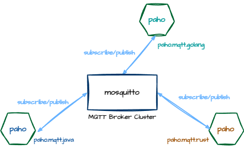

# Hello MQTT



> [paho](https://eclipse.dev/paho/)
>
- `spring-integration-mqtt` ->  <https://github.com/eclipse/paho.mqtt.java>
- <https://github.com/eclipse/paho.mqtt.rust>
- <https://github.com/eclipse/paho.mqtt.golang>

1 Start [Eclipse Mosquitto](https://mosquitto.org/)

```sh
# brew install mosquitto
# /usr/local/opt/mosquitto/sbin/mosquitto -c /usr/local/etc/mosquitto/mosquitto.conf
mosquitto -c /usr/local/etc/mosquitto/mosquitto.conf
```

2 Build

`build.sh`

```sh
mvn clean install -DskipTests
```

3 Start service

`start-service.sh`

```sh
cd mqtt-service 
mvn spring-boot:run 
```

4 Start sensor

`start-sensor.sh`

```sh
cd mqtt-sensor 
mvn spring-boot:run 
```

5 Look up stats

```sh
curl http://localhost:8080/temps/stats
```

## MQTT Broker Implementations

A variety of high-quality MQTT brokers are available. The table below shows the most popular open source and commercial broker implementations.

| BROKER               | DESCRIPTION                                                  |
| -------------------- | ------------------------------------------------------------ |
| mosquitto            | mosquitto is an open source MQTT broker written in C. It fully supports MQTT 3.1 and MQTT 3.1.1 and is very lightweight. Due to its small size, this broker can be used on constrained devices. |
| HiveMQ               | HiveMQ is a scalable, high-performance MQTT broker suitable for mission critical deployments. It fully supports MQTT 3.1 and MQTT 3.1.1 and has features like websockets, clustering, and an open-source plugin system for Java developers. |
| Apache ActiveMQ      | ActiveMQ is an open-source multi-protocol message broker with a core written around JMS. It supports MQTT and maps MQTT semantics over JMS. |
| RabbitMQ             | RabbitMQ is a scalable, open-source message queue implementation, written in Erlang. It is an AMQP message broker but has an MQTT plugin available. Does not support all MQTT features (e.g. QoS 2). |
| mosca                | mosca is an open-source MQTT broker written in Node.js. It can operate as standalone or be embedded into any Node.js application. Does not implement all MQTT features (e.g. QoS 2). |
| RSMB                 | RSMB is a message broker by IBM available for personal use. It is written in C and is one of the oldest MQTT broker implementations available. |
| WebsphereMQ / IBM MQ | Websphere MQ is a commercial message- oriented middleware by IBM. Fully supports MQTT. |

## Reference

- <https://github.com/gregwhitaker/springboot-mqtt-example>
- <https://dzone.com/refcardz/getting-started-with-mqtt>
