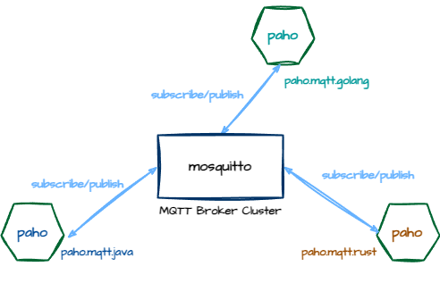

<!-- markdownlint-disable MD033 -->

# Hello MQTT



> [paho](https://eclipse.dev/paho/)
>
- `spring-integration-mqtt` ->  <https://github.com/eclipse/paho.mqtt.java>
- [paho-mqtt](<https://crates.io/crates/paho-mqtt>) <https://github.com/eclipse/paho.mqtt.rust>
- [go-mqtt](github.com/eclipse/paho.mqtt.golang) <https://github.com/eclipse/paho.mqtt.golang>

## 1 Start Broker

### [Eclipse Mosquitto](https://mosquitto.org/)

```sh
brew install mosquitto
```

```sh
sh start_mosquito.sh
```

### [EMQX](https://github.com/emqx/emqx)

```sh
brew install emqx
```

```sh
emqx start
```

```sh
$ emqx ctl status

Node 'emqx@127.0.0.1' 5.3.2 is started
```

```sh
emqx stop
```

#### [MQTTX Web](https://mqttx.app/web)

<http://localhost:18083/> The default user name and password are `admin` & `public`

#### [EMQX 文档](https://www.emqx.io/docs/zh/latest/)

[API 密钥](http://localhost:18083/#/api-key) 设置`API Key`和`Secret Key`

ak:9b71d224bd62f378
sk:mz0kFjgqbHPTUTAiBFcoY4rbmIsD3QXwJbaKQcNErlI

[HTTP API](http://localhost:18083/api-docs/index.html)

```sh
curl -i \
-u 9b71d224bd62f378:mz0kFjgqbHPTUTAiBFcoY4rbmIsD3QXwJbaKQcNErlI \
"http://localhost:18083/api/v5/nodes"

curl -i \
-u 9b71d224bd62f378:mz0kFjgqbHPTUTAiBFcoY4rbmIsD3QXwJbaKQcNErlI \
"http://localhost:18083/api/v5/topics"

curl -i \
-u 9b71d224bd62f378:mz0kFjgqbHPTUTAiBFcoY4rbmIsD3QXwJbaKQcNErlI \
"http://localhost:18083/api/v5/trace"
```

<http://localhost:18083/api-docs/index.html#/Publish/post_publish>

```sh
curl -i \
-u 9b71d224bd62f378:mz0kFjgqbHPTUTAiBFcoY4rbmIsD3QXwJbaKQcNErlI \
-X 'POST' \
  'http://localhost:18083/api/v5/publish' \
  -H 'accept: application/json' \
  -H 'Content-Type: application/json' \
  -d '{
  "topic": "mqtt/test",
  "payload": "hello emqx api"
}'
```

<http://localhost:18083/api-docs/index.html#/Clients/post_clients__clientid__subscribe>

```sh
curl -i \
    -u 9b71d224bd62f378:mz0kFjgqbHPTUTAiBFcoY4rbmIsD3QXwJbaKQcNErlI \
    -X 'POST' \
    "http://localhost:18083/api/v5/clients/java_publish_client/subscribe" \
    -H 'accept: application/json' \
    -H 'Content-Type: application/json' \
    -d '{
   "topic": "mqtt/test"
}'
```

<https://www.emqx.io/docs/zh/latest/deploy/upgrade-from-v4.html#http-api>

## 2 Build Client

> 使用emqx实验时，确保<http://localhost:18083/#/authentication>页面中没有配置

### hello-mqtt-java build

`build.sh`

```sh
mvn clean install -DskipTests
```

### hello-mqtt-rust build

```sh
cargo build
```

### hello-mqtt-go build

```sh
go env -w GOPROXY=https://goproxy.cn,direct
go get github.com/eclipse/paho.mqtt.golang
go build
```

## 3 Run Client

### hello-mqtt-java run

#### service

`start_service.sh`

```sh
cd mqtt-service 
mvn spring-boot:run 
```

`look_up.sh`

```sh
curl http://localhost:8080/temps/stats
```

#### sensor

`start_sensor.sh`

```sh
cd mqtt-sensor 
mvn spring-boot:run 
```

### hello-mqtt-rust run

#### sub

```sh
cargo run --bin sub
```

#### pub

```sh
cargo run --bin pub
```

### hello-mqtt-go run

```sh
go run main.go
```

## Reference

- <https://github.com/gregwhitaker/springboot-mqtt-example>
- <https://dzone.com/refcardz/getting-started-with-mqtt>
- [MQTT 客户端编程](https://www.emqx.io/docs/zh/latest/tutorial/mqtt-programming.html)
