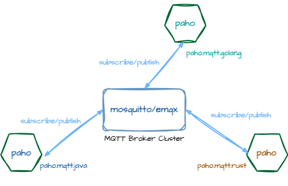

# Hello MQTT



> [paho](https://eclipse.dev/paho/)
>
- `spring-integration-mqtt` ->  <https://github.com/eclipse/paho.mqtt.java>
- <https://github.com/eclipse/paho.mqtt.rust>
- <https://github.com/eclipse/paho.mqtt.golang>

## 1 Start 

[Eclipse Mosquitto](https://mosquitto.org/)

```sh
# brew install mosquitto

```

[EMQX](https://github.com/emqx/emqx)

```sh
brew install emqx
emqx start
```

2 Build

`build.sh`

```sh
mvn clean install -DskipTests
```

3 Run 

service

`start-service.sh`

```sh
cd mqtt-service 
mvn spring-boot:run 
```

sensor

`start-sensor.sh`

```sh
cd mqtt-sensor 
mvn spring-boot:run 
```

4 Look up stats

```sh
curl http://localhost:8080/temps/stats
```

## Reference

- <https://github.com/gregwhitaker/springboot-mqtt-example>
- <https://dzone.com/refcardz/getting-started-with-mqtt>
